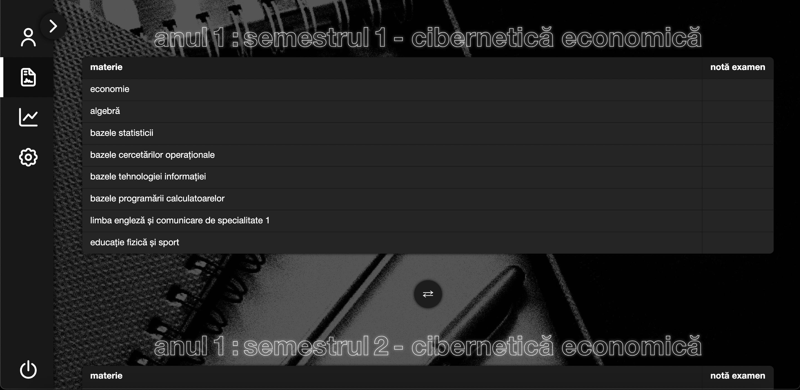

  

**studentxyz** este o aplicație web destinată studenților academiei de studii economice, care oferă o platformă inteligentă pentru urmărirea performanțelor academice și dezvoltarea personală, utilizând algoritmi de machine learning.

## funcționalități principale

- **autentificare securizată**: accesul este permis doar cu adrese de e-mail instituționale de forma `@stud.ase.ro`.

- **selectarea facultății și introducerea notelor**: studenții își aleg facultatea și introduc notele finale pentru fiecare materie din anul curent, organizate pe semestre.

- **estimarea performanțelor viitoare**: folosind machine learning, aplicația prezice performanțele academice în semestrul sau anul următor. *de exemplu, dacă un student a obținut rezultate bune la materii precum bpc sau bti, există șanse mari să se descurce bine și la atp sau so.*

- **analiza progresului**: vizualizări grafice și date statistice care reflectă evoluția academică a studentului de-a lungul timpului.

- **identificarea skill-urilor**: pe baza notelor obținute, aplicația deduce competențele și abilitățile studentului în diverse domenii.

- **sfaturi personalizate**: recomandări adaptate în funcție de skill-urile identificate, pentru a sprijini dezvoltarea personală și academică.

- **profiluri individuale**: fiecare student are un profil care poate fi setat ca public sau privat. de asemenea, există posibilitatea de a adăuga prieteni și de a compara performanțele academice cu aceștia.

## tehnologii utilizate

- **frontend**: html, css, javascript
- **backend**: python (flask)
- **bază de date**: sqlite
- **machine learning**: algoritmi pentru regresie și clasificare (detalii în curs de implementare)

## structură proiect

- `app.py`: fișierul principal al aplicației flask
- `templates/`: șabloane html pentru interfața utilizator
- `static/`: fișiere css și js
- `database.db`: baza de date sqlite
- `requirements.txt`: lista de dependințe necesare
- `procfile`: fișier pentru deploy pe heroku

## contribuții

proiectul este în dezvoltare activă. contribuțiile sunt binevenite. pentru sugestii sau raportarea bug-urilor, vă rugăm să deschideți un issue în acest repository.

## licență

© 2025 marelegsaa - toate drepturile rezervate.
