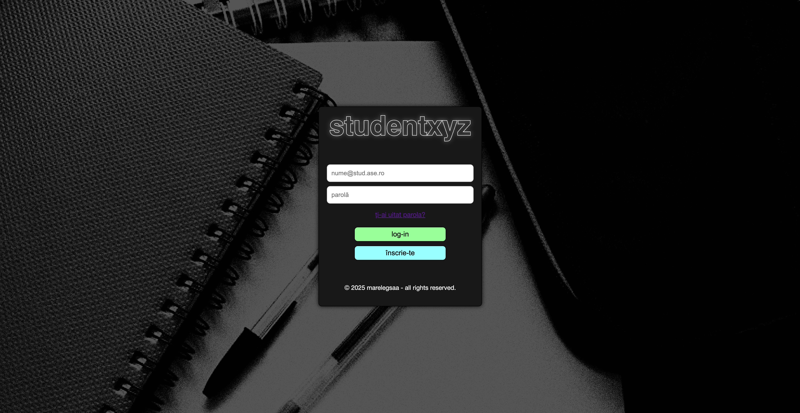
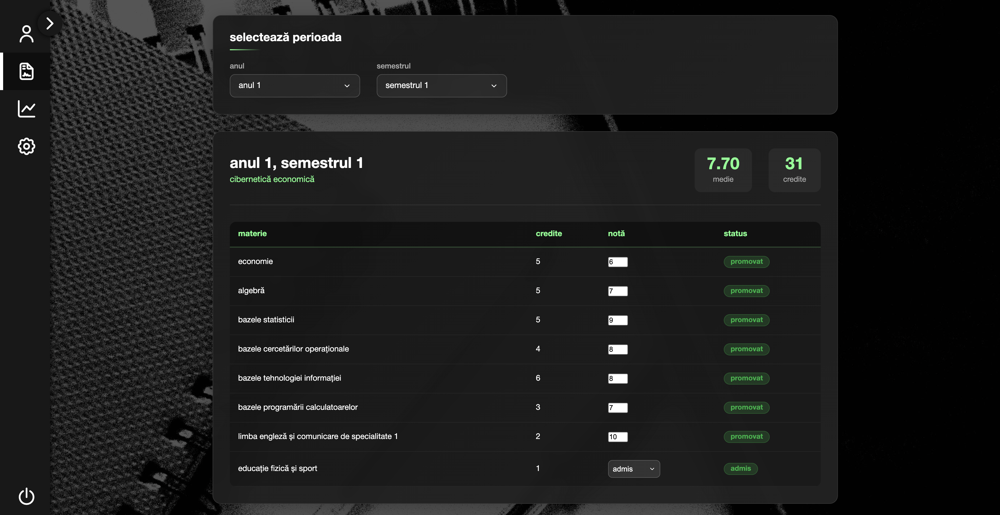
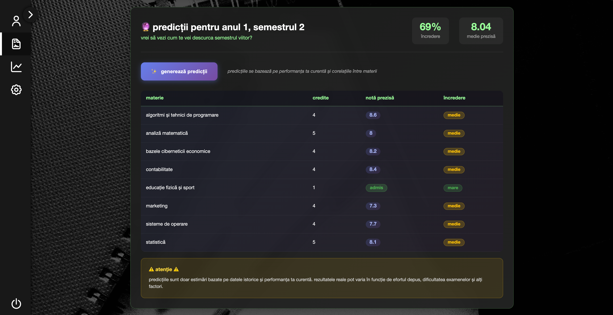
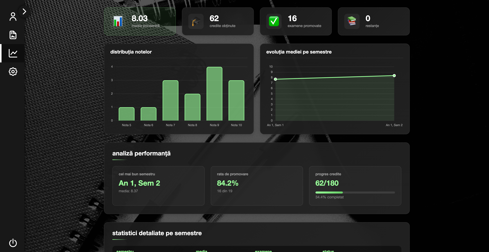
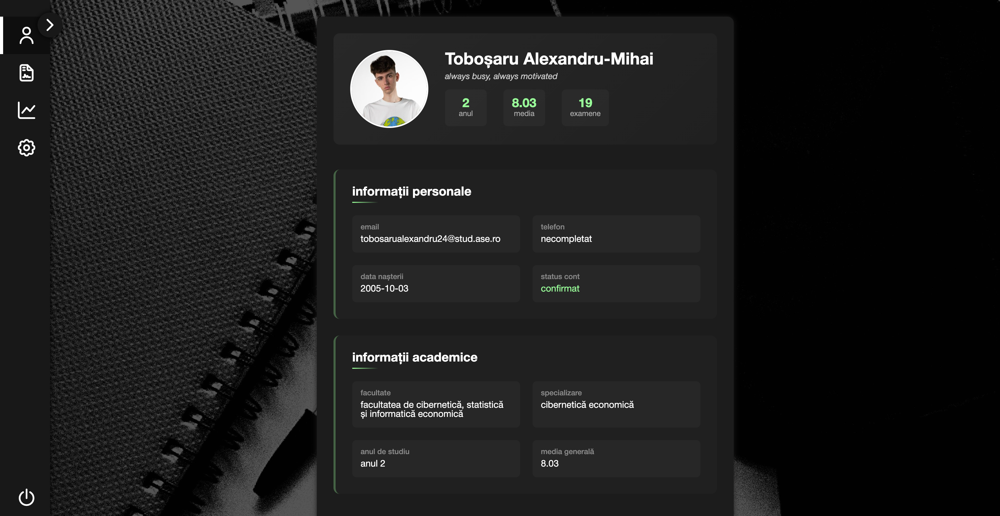
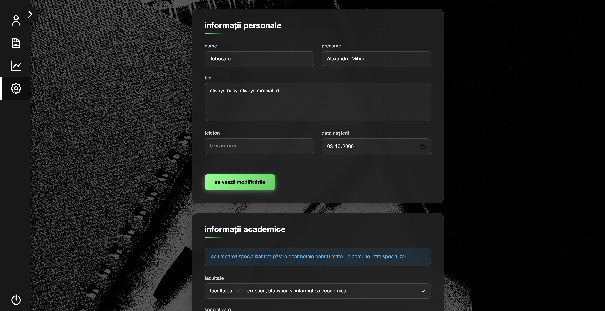

  

**studentxyz** este o aplicație web destinată studenților academiei de studii economice, care oferă o platformă inteligentă pentru urmărirea performanțelor academice și dezvoltarea personală.

## funcționalități principale

- **autentificare securizată**: accesul este permis doar cu adrese de e-mail instituționale de forma `@stud.ase.ro`.

- **selectarea facultății și introducerea notelor**: studenții își aleg facultatea și introduc notele finale pentru fiecare materie din anul curent, organizate pe semestre.

- **estimarea performanțelor viitoare**: aplicația prezice performanțele academice în semestrul următor, în funcție de dificultatea materiei și de performanțele tale anterioare. *de exemplu, dacă un student a obținut rezultate bune la materii precum bpc sau bti, există șanse mari să se descurce bine și la atp sau so.*

- **analiza progresului**: vizualizări grafice și date statistice care reflectă evoluția academică a studentului de-a lungul timpului.

- **profiluri individuale**: fiecare student are un profil care conține informații personale și academice pentru a avea toate datele organizate într-un singur loc

- **modificarea informațiilor contului**: utilizatorul poate schimba orice informație ce ține de contul său (ex. email, parolă, facultate, specializare)

## tehnologii utilizate

- **frontend**: html, css, javascript
- **backend**: python (flask)
- **bază de date**: sqlite
- **deployment**: raspberry pi 5 (folosit ca server)

## structură proiect

- `app.py`: fișierul principal al aplicației flask
- `models.py`: clasele și caracteristicile fiecărui student din baza de date
- `validari.py`: materiile și creditele aferente materiilor fiecărei specializări
- `dbmigration.py`: pentru adăugarea de noi caracteristici în baza de date
- `templates/`: fișiere html
- `static/`: fișiere css, js, fonturi folosite
- `screenshots/`: preview pentru website
- `requirements.txt`: lista de dependințe necesare
- `procfile`: fișier pentru deployment

## contribuții

proiectul este în dezvoltare activă. momentan implementat doar pentru studenții facultății de cibernetică, statistică și informatică economică. contribuțiile sunt binevenite. pentru sugestii sau raportarea bug-urilor, vă rugăm să deschideți un issue în acest repository.

## licență

© 2025 marelegsaa - toate drepturile rezervate.
